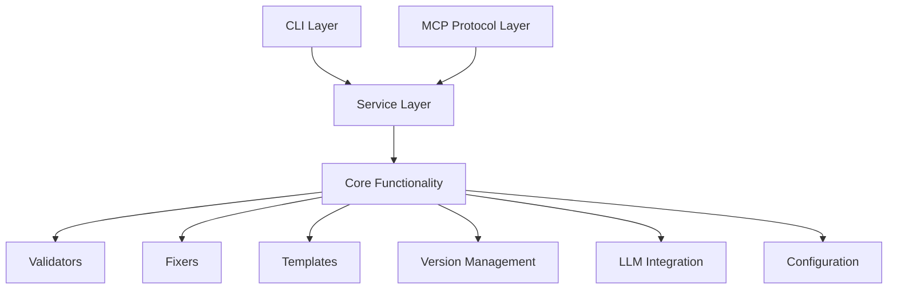
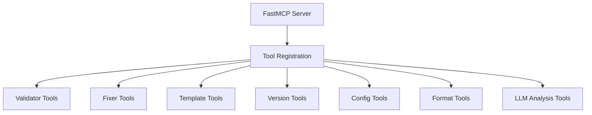
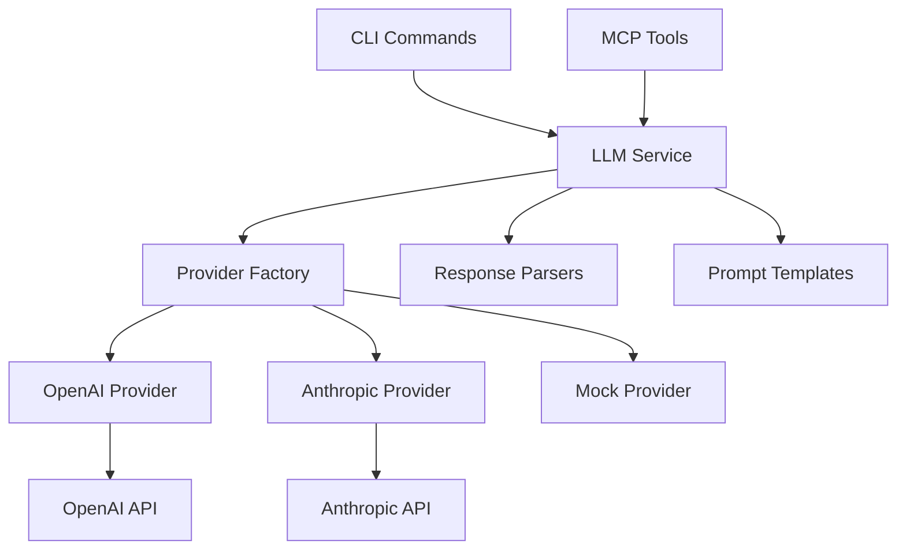
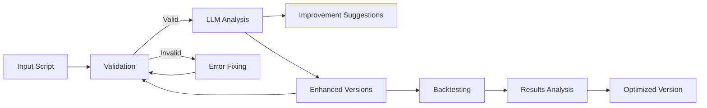
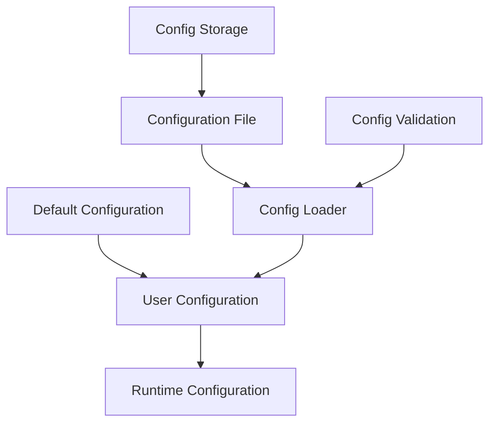

# System Patterns

## Overall Architecture

The PineScript MCP project follows a modular architecture with several key components:

1. **Core Backend Services**:
   - Template Management System
   - LLM Provider Integration
   - Analysis Engine
   - Database Services

2. **User Interface**:
   - Web UI (Next.js)
   - Desktop Application (Electron)
   - Command Line Interface

3. **External Integrations**:
   - LLM Providers (OpenAI, Anthropic)
   - Data Storage (Supabase)
   - TradingView Platform

## UI Architecture

### Web UI (Next.js)

The web-based UI is built using Next.js with React and follows these patterns:

1. **Component Structure**:
   - Page-level components for main views
   - Reusable UI components shared across pages
   - Layout components for consistent structure

2. **State Management**:
   - React context for global state
   - Local component state for UI-specific state
   - API integration for data fetching

3. **Routing**:
   - Next.js file-based routing
   - Dynamic routes for strategy and analysis views

### Desktop Application (Electron)

The Electron desktop application provides a server-less alternative with these patterns:

1. **Process Architecture**:
   - Main Process: Handles system operations, file access, and window management
   - Renderer Process: Manages UI rendering and user interactions
   - Preload Script: Creates secure bridge between processes

2. **IPC Communication**:
   - Contextbridge for secure exposure of main process APIs
   - Async/await pattern for IPC calls
   - Structured request/response system for data operations

3. **UI Implementation**:
   - Direct HTML/CSS/JS for the renderer
   - Tailwind CSS for consistent styling with web UI
   - Client-side navigation between views

4. **File Management**:
   - Local file access through IPC channels
   - Secure bridging through contextIsolation
   - JSON-based data storage for portability

## Backend Architecture

The backend follows these architectural patterns:

1. **Service Pattern**:
   - Each major functionality is encapsulated as a service
   - Services are accessed through a common interface
   - Dependency injection for service composition

2. **Provider Pattern**:
   - Abstract provider interfaces for different implementations
   - Factory methods for provider selection
   - Graceful fallback mechanisms
   - Consistent input/output formats across providers

3. **Template System**:
   - Structured template format with defined sections
   - Template registry for centralized management
   - Version control and history tracking
   - Vector embeddings for semantic search

4. **Repository Pattern**:
   - Data access through repository abstractions
   - Transaction support for multi-step operations
   - Caching for performance optimization
   - Error handling and retry logic

## Command Line Interface

The CLI follows these patterns:

1. **Command Structure**:
   - Command registry for automatic discovery
   - Command groups for related functionality
   - Consistent help documentation
   - Input validation and error handling

2. **Output Formatting**:
   - Structured console output with color coding
   - Table formatting for data display
   - Progress indicators for long-running operations
   - Error messages with actionable information

## Data Flow

1. **Strategy Analysis Flow**:
   - Strategy code input → Parser → Context Enrichment → LLM Provider → Results Formatter → User Output

2. **Template Management Flow**:
   - Template Definition → Validation → Storage → Embedding Generation → Searchable Index

3. **Backtest Analysis Flow**:
   - Backtest Results → Metrics Calculation → Context Assembly → LLM Analysis → Visualization

## Error Handling

1. **Graceful Degradation**:
   - Fallback mechanisms for unavailable services
   - Mock providers for development and testing
   - Informative error messages for users

2. **Error Categories**:
   - Configuration errors (missing API keys, etc.)
   - Network errors (API connectivity issues)
   - Validation errors (invalid input formats)
   - Processing errors (LLM response parsing issues)

## Testing Approach

1. **Unit Testing**:
   - Component-level tests with jest
   - Service isolation with mocks
   - Validation of error handling

2. **Integration Testing**:
   - End-to-end workflows
   - API contract validation
   - Cross-provider testing

3. **UI Testing**:
   - Component rendering tests
   - User interaction simulation
   - Responsive design validation

## Environment Handling

1. **Configuration Management**:
   - Environment variables for credentials
   - Configuration files for defaults
   - User-level customization options

2. **Development Environment**:
   - Local mock providers
   - Test data generation
   - Development-specific configuration
   - Hot reloading for rapid iteration

## Deployment Patterns

1. **Production Deployment**:
   - Environment-specific configuration
   - CI/CD pipeline integration
   - Versioned releases

2. **Desktop Deployment**:
   - Electron packaging for distribution
   - Automatic updates
   - Cross-platform compatibility (Windows, Mac, Linux)

## Design Patterns Used

1. Singleton Pattern (for LLM service, template manager)
2. Factory Pattern (for provider selection, template creation)
3. Repository Pattern (for data access)
4. Strategy Pattern (for different analysis approaches)
5. Observer Pattern (for event-driven updates)
6. Adapter Pattern (for consistent provider interfaces)
7. Builder Pattern (for prompt construction)
8. Command Pattern (for CLI architecture)
9. Process Communication Pattern (for Electron IPC)
10. Module Pattern (for code organization)

## High-Level Architecture

The system follows a layered architecture with clear separation of concerns:

## Design Patterns Used

### Factory Pattern

Used in:
- **Template Creation**: Templates are created based on PineScript version and requirements
- **Provider Selection**: LLM providers are selected based on configuration settings

### Strategy Pattern

Used in:
- **Error Fixers**: Different strategies for fixing different types of errors
- **Validation Approaches**: Different validation approaches based on script type

### Observer Pattern

Used in:
- **Error Notification**: Components can subscribe to error events
- **Config Changes**: Services can observe configuration changes

### Adapter Pattern

Used in:
- **LLM Integration**: Adapting different LLM APIs to a unified interface
- **Protocol Handling**: Adapting various communication protocols to internal structures

### Singleton Pattern

Used in:
- **Configuration Manager**: Single instance for accessing configuration
- **Version Manager**: Single instance for managing versions
- **LLM Service**: Single instance for handling LLM interactions

## Component Architecture

### MCP Server

### Core Components

```mermaid
flowchart TD
    Config[Configuration System] --> UserConfig[User Config]
    Config --> SystemConfig[System Config]
    
    Validation[Validation System] --> SyntaxValidator[Syntax Validator]
    Validation --> RuleValidator[Rule Validator]
    
    Fixing[Fixing System] --> ErrorFixer[Error Fixer]
    Fixing --> DeprecationFixer[Deprecation Fixer]
    
    Templates[Template System] --> TemplateManager[Template Manager]
    Templates --> TemplateRepo[Template Repository]
    
    Versions[Version System] --> VersionDetector[Version Detector]
    Versions --> VersionConverter[Version Converter]
    Versions --> VersionManager[Version Manager]
    
    LLM[LLM Integration] --> LLMService[LLM Service]
    LLM --> Providers[Provider Implementations]
    LLM --> Analysis[Strategy Analysis]
    LLM --> Generation[Strategy Generation]
```

## LLM Integration Architecture

The LLM integration follows a modular architecture with multiple layers:

### Key Components of LLM Integration

1. **LLM Service**: Central service that coordinates interactions with language models
   - Maintains a singleton instance for application-wide access
   - Delegates to appropriate provider based on configuration
   - Handles common tasks like error handling and fallback mechanisms
   - Provides interfaces for strategy analysis, enhancement, and backtest analysis

2. **Provider Factory**: Creates and returns the configured LLM provider
   - Reads configuration to determine which provider to use
   - Initializes provider with appropriate API keys and settings
   - Falls back to mock provider if required configuration is missing or authentication fails

3. **Provider Implementations**: Concrete implementations for different LLM providers
   - **OpenAI Provider**
     - Connects to OpenAI API with robust authentication handling
     - Extracts API keys reliably from multiple sources (.env, environment variables, config)
     - Provides custom JSON response handling with error tolerance
     - Implements normalization for consistent response structures
     - Includes extensive debugging and logging
   - **Mock Provider**
     - Provides realistic but static responses for testing
     - Mimics the behavior of real providers without external dependencies
     - Allows development without API keys or costs
   - **Anthropic Provider (Planned)**
     - Will implement the common LLM provider interface for Claude models
     - Will follow the same robust error handling patterns as OpenAI

4. **Response Parsers**: Convert LLM responses into structured data
   - Parse JSON responses into typed objects
   - Handle error cases and malformed responses
   - Apply validation to ensure response integrity
   - Normalize responses for consistent handling
   - Extract relevant JSON data from potentially unstructured responses

5. **Prompt Templates**: Manage templates for different types of LLM requests
   - Strategy analysis prompts
   - Backtest analysis prompts
   - Enhancement generation prompts
   - Include examples of expected response formats
   - Clearly structure requirements for model responses

## Data Flow

## Configuration Management

The system uses a hierarchical configuration management approach:

## External Service Credentials

### Environment Variable Best Practices

1. **Never hardcode credentials in the source code**
   - All external service credentials should be stored in environment variables
   - Development environments should utilize `.env.local` files that are gitignored
   - Production environments should use platform-specific environment variable configurations

2. **Environment variable management**
   - Use `.env.example` to document required variables
   - Implement typed access to environment variables with graceful fallbacks
   - Validate environment variables at application startup
   - Prefix client-side variables with `NEXT_PUBLIC_` in Next.js

3. **Credential validation**
   - Ensure the presence of required environment variables
   - Validate that credentials meet minimum format requirements
   - Provide clear error messages for missing or invalid credentials
   - Implement fallback behaviors for development environments

### Supabase Integration

1. **Client initialization**
   - Initialize the Supabase client only when valid credentials are available
   - Implement graceful fallbacks in development environments
   - Provide clear logging about credential status

2. **Error handling**
   - Catch and log Supabase operation errors properly
   - Provide user-friendly error messages without exposing sensitive details
   - Implement retry mechanisms for transient errors

3. **Data access patterns**
   - Use proper Row Level Security (RLS) for table access
   - Define typed interfaces for all database models
   - Implement data validation before insertion 